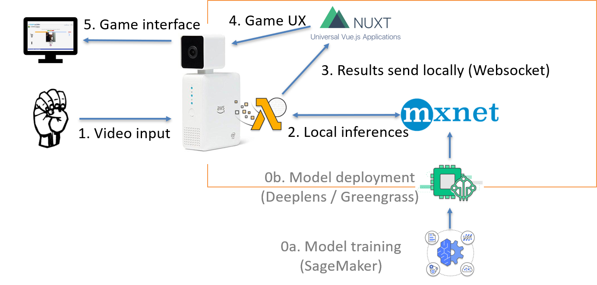

# deeplens-asl-game
Deeplens game to learn ASL (American Sign Language)

Nowadays, technology reduces the distances, and allow us to communicate with each other even if not in the same place. Real-time translations permits to speach with people of differente languages and cultures. But there are some cases where communication is difficult. For example, deaf people (and mute ones) could not easily communicate with other people, because nearly no one can speak ASL.

The processing of video flow and a deep learning model can leverage the Deeplens as a new interface for helping everyone to take into account those difficulties, and focusing on education.

It's a little game to learn ASL (for hearing people). The goal is to make the words the more quickly possible, with the higher accuracy. Each letter is indicating in roman and ASL alphabet. A timer is indicating the time left. You have 3 tries by word.

We have chosen the alphabet because it is mainly composed of static hands positions. Our model is homemade, based on a Sagemaker vision model, fine trained on a specific dataset we have made. We have removed ‘j’ and ‘z’ letters, as they require movement.

## Demo video

Video available on Youtube

## How to use it

### Deployment
The model is located in the *model* folder and the Lambda function handler is located in the *lambda* folder. To use it, you just have to follow the same steps as described in the [AWS documentation](https://docs.aws.amazon.com/deeplens/latest/dg/deeplens-train-model.html) starting step 4.

Once deployed on the DeepLens, you will have deploy the game interface :
[TODO]

###  Interface

[TODO]

Be careful: there is a small delay between your movement and the camera feedback.

Here is the ASL alphabet that you can use: 

Samples can be found in the [samples folder](samples/) (images were extracted from our dataset).

## How we made it

The dataset was homemade. We have taken different pictures with different people for each letter of the alphabet (except 'j' and 'z'). We have used data augmentation (mirror and crops) to have ~1000 images by letter.

The training was done using Amazon SageMaker, with transfer learning on a resnet with 18 layers. It converges in 5 epochs to a satisfaying result.

[TODO: game creation]

This is the project architecture:

## Who we are

[TODO]
